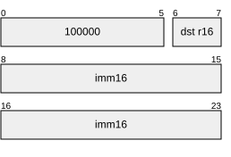
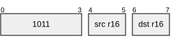
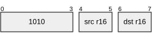
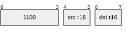

# Basic Mnemonix Set A

### Registers (R16)

| Register | Bitpattern |
| -------- | ---------- |
| A        | 00         |
| X        | 01         |
| Y        | 10         |
| Z        | 11         |

### Flags

CF Carry

### Other Elements

imm16: signed or unsigned 16 bit value

### Instructions

##### MOV reg16, imm16

`dst <- imm16`

##### MOV reg16, reg16

`dst <- src`

##### ADD reg16, reg16

`dst <- dst + src`

##### ADC reg16, reg16

`dst <- dst + src + CF`

Flags affected:
CF will be the overflow bit, if size of result exceeds an unsigned 16 bit result.

##### AND reg16, reg16

`dst <- src && dst`
